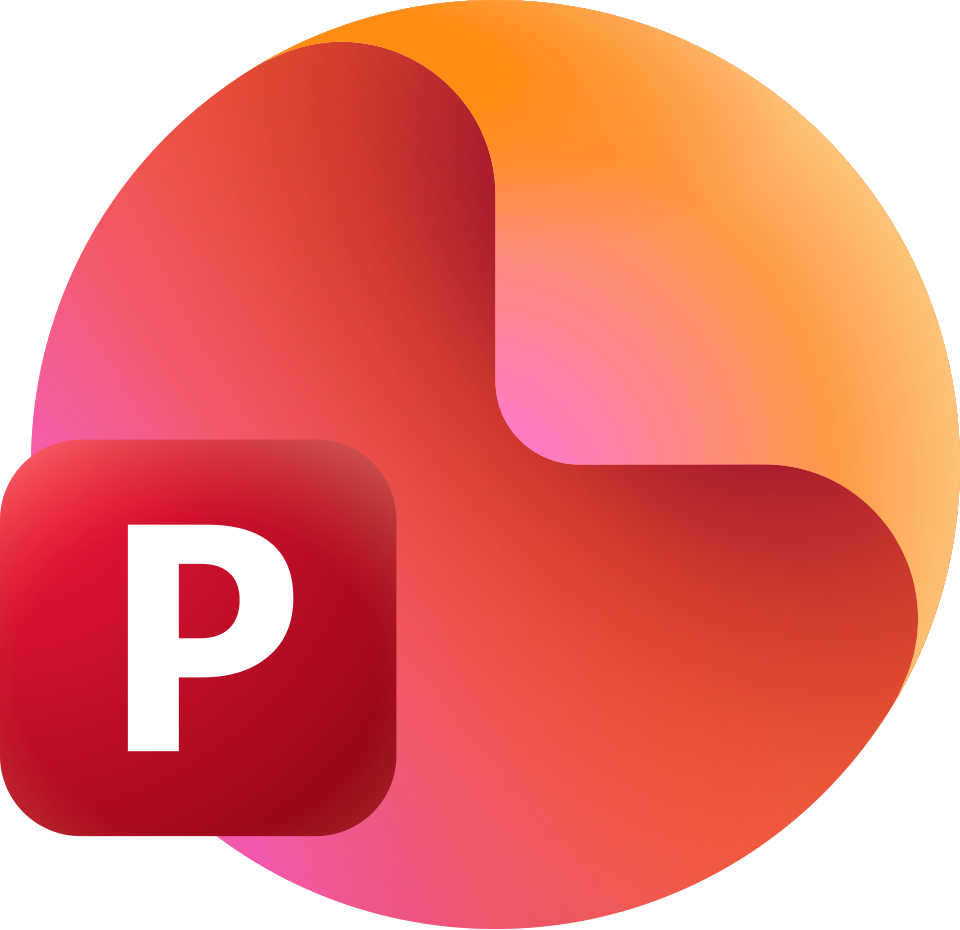

  

I am an undergraduate Information Technology student with a strong interest in **Data Science** and **Artificial Intelligence**. I enjoy transforming data into meaningful insights through analysis, visualization, and machine learning. I am continuously learning new technologies while building real-world projects that solve practical problems.

## Regularly Using

  

  
  
  

## Connect with Me

  
  &nbsp;
  
  &nbsp;
  
  &nbsp;
  
  <code>brrraar</code>

## Statistics

  
  

